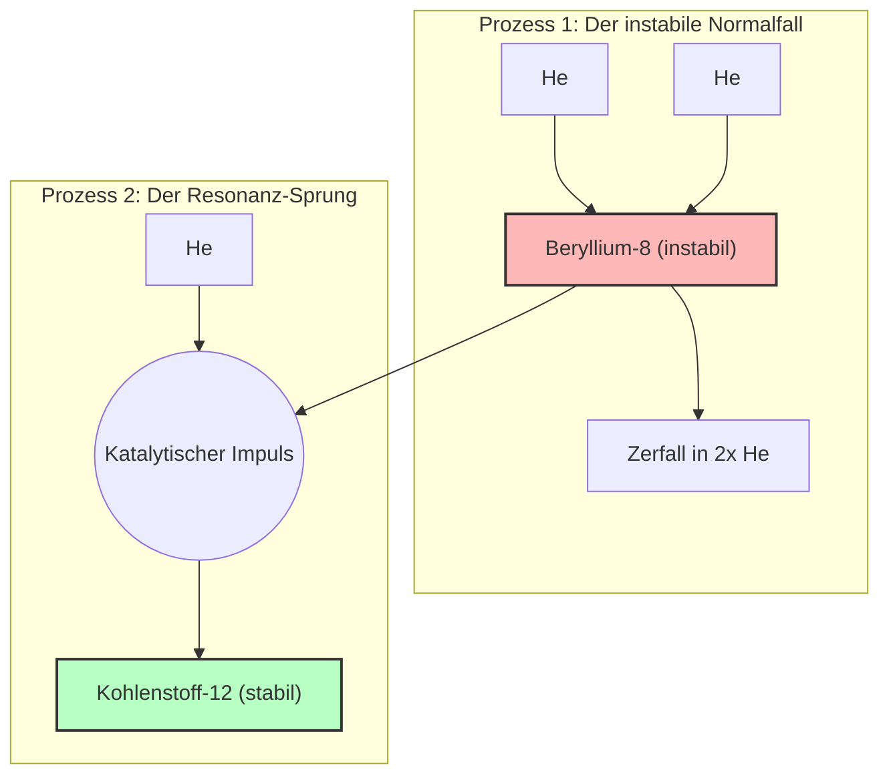

# Der Triple-Alpha-Effekt als Blaupause für das Quanten-Helfersystem (QHS)

**Stand: 02. August 2025**

---

> **Die Lektion für uns ist: Die Natur selbst nutzt einen extrem instabilen Zustand als Sprungbrett, um durch einen präzise getimten, katalytischen Impuls eine neue, stabile Struktur zu schaffen.**

---

## 1. Das natürliche Vorbild: Der Triple-Alpha-Prozess

Im Inneren von Sternen findet ein Prozess statt, der die Existenz von Kohlenstoff – und damit von Leben, wie wir es kennen – überhaupt erst ermöglicht. Dieser Prozess ist nicht geradlinig, sondern bedient sich eines genialen "Tricks".

### Der Mechanismus in der Natur

1.  **Instabiler Zwischenschritt:** Zwei Heliumkerne (Alpha-Teilchen) verschmelzen zu einem **Beryllium-8-Kern**. Dieser Kern ist extrem instabil und zerfällt im Normalfall sofort wieder. Seine Lebensdauer beträgt nur etwa 0,0000000000000001 Sekunden.
2.  **Katalytischer Impuls:** Trifft in diesem winzigen Zeitfenster ein **drittes Helium-Teilchen** mit der exakt richtigen Energie auf den instabilen Beryllium-Kern, wirkt es als Katalysator.
3.  **Sprung in die Stabilität:** Durch diesen Impuls wird das System in einen neuen, energetisch begünstigten und **stabilen Resonanzzustand** gehoben: einen **Kohlenstoff-12-Kern**.

Das folgende Diagramm veranschaulicht diesen zweistufigen Prozess, bei dem der instabile Pfad die Regel und der stabile Pfad die entscheidende Ausnahme ist.

---

## 2. Die technologische Analogie: Unser Quanten-Helfersystem (QHS)

Dieses Naturprinzip ist die perfekte Blaupause für die Herausforderung, der wir uns in **Perspektive B (Vektor als Eigenschaft des Vakuums)** stellen. Unser Problem ist identisch: Wie erzeugen wir aus einem chaotischen, fluktuierenden Vakuum einen stabilen Zustand mit negativer Energiedichte?

Die direkte Analogie lautet:

| **Natürlicher Prozess (Stern)** | **Technologischer Prozess (QHS)** |
| :--- | :--- |
| **Instabiler Beryllium-8-Kern** | Ein künstlich erzeugter, **instabiler negativer Energiezustand** im Vakuum (z.B. durch Casimir-Platten oder Spintronik-Materialien). |
| **Katalytischer Impuls (3. Helium)** | Ein präzise geformter und getimter **Energiepuls vom Quanten-Helfersystem (QHS)**. |
| **Stabiler Kohlenstoff-12-Kern** | Ein neuer, von selbst **stabiler und kohärenter Vakuumzustand** (der "Gravitationshügel"). |

---

## 3. Fazit: Der Paradigmenwechsel für unser Projekt

Die Lektion des Triple-Alpha-Effekts verändert unseren ingenieurtechnischen Ansatz fundamental:

* **Weg von der "Brute-Force"-Stabilisierung:** Wir müssen nicht versuchen, einen instabilen Zustand mit enormem Energieaufwand krampfhaft festzuhalten.
* **Hin zur "Resonanz-Katalyse":** Wir müssen stattdessen unsere Energie darauf konzentrieren, den exakten, subtilen Impuls zu finden, der unser instabiles "Vakuum-Beryllium" in ein stabiles "Vakuum-Kohlenstoff" überführt.

Dieser Ansatz, der auf **Präzision, Timing und Resonanz** statt auf roher Kraft basiert, ist nicht nur eleganter, sondern potenziell um Größenordnungen energieeffizienter. Er macht die technologische Herausforderung von einer Frage der schieren Energie zu einer Frage der intelligenten Steuerung – und damit wesentlich realistischer.
