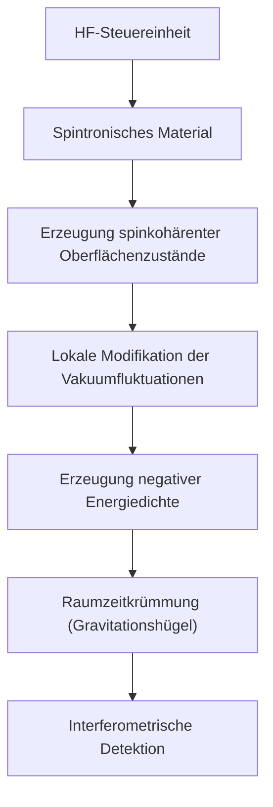

# QHS-Prototyp – Spintronic Vacuum Engineering Modul

**Stand: 19. Juli 2025**

---

## Zielsetzung

Dieses Dokument beschreibt einen prototypischen Aufbau des Quanten-Helfersystems (QHS), dessen Ziel es ist, lokal kontrollierte Vakuumzustände mit negativer Energiedichte zu erzeugen. Die Grundlage bildet das Konzept des **Spintronic Vacuum Engineering** – eine hypothesenbasierte Methode, mit der die Eigenschaften des Quantenvakuums mittels spinkohärenter Materialien und dynamischer Feldkontrolle gezielt beeinflusst werden sollen.

---

## Überblick: Spintronic Vacuum Engineering

**Spintronik** nutzt nicht nur die elektrische Ladung, sondern auch den **Spin** des Elektrons zur Informationsverarbeitung. Für unser Vorhaben besonders relevant sind folgende Effekte:

- **Giant Magnetoresistance (GMR)**
- **Tunnel Magnetoresistance (TMR)**
- **Spin-Hall- & Inverse-Spin-Hall-Effekte**
- **Rashba-Effekt** (spinkontrollierte Kopplung durch elektrische Felder)
- **Spin-Transfer-Torque**

Ziel ist es, mit Hilfe dieser Effekte lokal das elektromagnetische Vakuumfeld zu modulieren.

---

## Wirkprinzip: Einfluss auf das Quantenvakuum

Die Hypothese lautet: Spinkohärente Systeme erzeugen **asymmetrische Feldbedingungen**, welche die Modenstruktur des Quantenvakuums lokal verändern – vergleichbar mit einer Erweiterung des Casimir-Effekts.

### Mechanismus

1. Spinkohärente Materialien erzeugen kontrollierte Oberflächenzustände
2. Diese koppeln an elektromagnetische Vakuummoden
3. Die Vakuumenergie wird lokal moduliert – Ziel: negative Energiedichte
4. Das System reagiert auf externe Steuerimpulse (elektrisch, HF, rotatorisch)

---

## QHS-Prototyp: Komponenten & Aufbau

| Komponente | Funktion |
|------------|----------|
| **Spintronisches Material** (z. B. Pt/YIG, Graphen-TI) | Erzeugung spinkohärenter Zustände |
| **Magnetfeldquelle** | Justierung & Kontrolle der Spinpolarisation |
| **HF-Steuereinheit** | Dynamische Spinmodulation |
| **Kryokammer (UHV)** | Minimierung thermischer Störungen |
| **Casimir-Plattenmodul** | Vergleichsmessung zur Vakuummodifikation |
| **Optischer Interferometer** | Detektion von Raumzeitkrümmungseffekten |
| **Data Logger & Steuerungs-UI** | Aufzeichnung und Kontrolle |

---

## Schema: Zusammenspiel von QHS & Spintronic Vacuum Engineering

---

## Zielmessgrößen

- Änderung der Lichtlaufzeit im Vakuum
- Gravitative Masseabweichung (hochpräzise Waagen)
- Interferometrische Phasenverschiebung
- Strukturelle Resonanzeffekte (acoustic Casimir)

---

## Fazit

Das QHS-Prototypenmodell stellt den nächsten logischen Schritt dar, um die theoretischen Konzepte der Perspektive B (Vakuum als strukturierte Grundlage) in die experimentelle Realität zu überführen. Mit Hilfe moderner Spintronik und präziser Quantenmesstechnik entsteht hier der erste Engineering-Hebel zur kontrollierten Raumzeitmodifikation.

