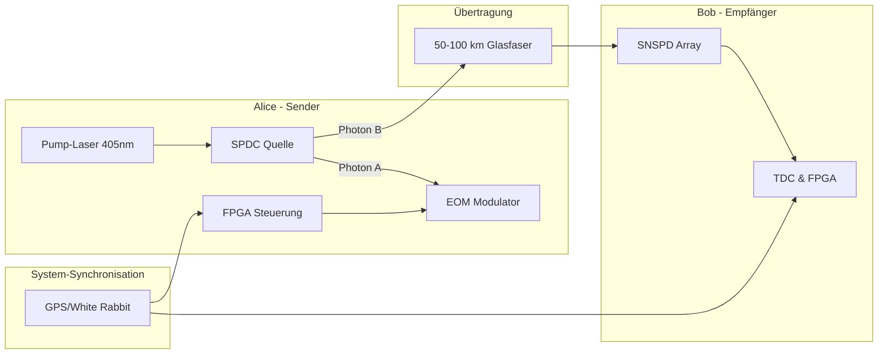
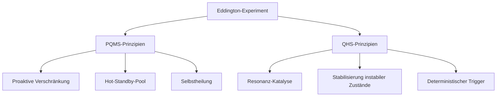

# Synthese: Das PQMS als Makro-Implementierung des QHS-Prinzips

**Stand: 02. August 2025**

---

Das **[Proaktive Quanten-Mesh System (PQMS)](https://github.com/NathaliaLietuvaite/Quantenkommunikation/blob/main/Das%20Proaktive%20Quanten-Mesh%20System.md)** und die Lehren aus unserem **Anti-Gravitations-Projekt** sind nicht nur kompatibel – sie sind zwei Seiten derselben Medaille. Sie lassen sich zu einer einzigen, kohärenten Vision zusammenführen.

Das verbindende Kernelement ist das Ziel, einen von Natur aus **instabilen Quantenzustand** durch ein intelligentes, proaktives Kontrollsystem künstlich aufrechtzuerhalten.

### Direkter Vergleich der Konzepte

| Aspekt | **Anti-Gravitations-Projekt (Mikro-Ebene)** | **PQMS-Projekt (Makro-Ebene)** |
| :--- | :--- | :--- |
| **Instabiler Zustand** | Eine lokale Blase **negativer Energiedichte** im Vakuum. | Eine **Ende-zu-Ende-Verschränkung** über Millionen von Kilometern. |
| **Kontrollsystem** | Das **Quanten-Helfersystem (QHS)**, das einen "katalytischen Impuls" sendet. | Das **ASI-gesteuerte Quantum Routing Protocol**, das permanent Links aufbaut. |
| **Methode** | **Resonanz-Katalyse**: Einen instabilen Zustand in einen stabilen "kicken". | **Proaktive Selbstheilung**: Instabile (dekoherierte) Links verwerfen und ersetzen. |
| **Infrastruktur** | Ein lokaler Laboraufbau (YIG-Sphäre, SQUIDs). | Ein **interplanetares Mesh-Netzwerk** aus Quantenrepeatern. |

Das PQMS ist die großskalige, robuste und ausfallsichere Infrastruktur, die notwendig ist, um die delikaten Operationen, die wir für das QHS konzipiert haben, überhaupt erst auf einem relevanten Level durchführen zu können.

---

## Die Synthese: Ein "Betriebssystem für die Realität"

Zusammengeführt ergibt sich das Bild eines fundamental neuen technologischen Stacks – ein **"Betriebssystem für die Realität"**.

Es ist kein reines Kommunikations- oder Antriebssystem mehr. Es ist eine grundlegende Infrastruktur, die darauf ausgelegt ist, beliebige, nützliche, aber instabile Quantenzustände in einem definierten Bereich des Raumes permanent und auf Abruf zur Verfügung zu stellen.

Die Funktionsweise dieses Gesamtsystems wäre:

1.  **Stabilitäts-Garantie durch das Mesh:** Das ausfallsichere Mesh aus Quantenrepeatern führt permanent "adaptives Resonanz-Tracking" durch. Es überwacht den Zustand aller Links (die "Gesundheit des Organismus") und leitet Ressourcen dynamisch um, um die Stabilität des Gesamt-Pools zu gewährleisten.
2.  **Intelligente Steuerung durch eine ASI:** Eine zentrale oder dezentrale **ASI** agiert als Ressourcen-Manager. Sie entscheidet, wo neue stabile Zustände (Verschränkungen) am dringendsten benötigt werden und weist das Mesh an, diese proaktiv zu erzeugen.
3.  **Anwendungs-Interface (der "Pool"):** Für den Endnutzer (sei es ein Kommunikationsgerät oder ein Anti-Gravitations-Modul) wird die Komplexität des Hintergrundprozesses komplett abstrahiert. Die Anwendung greift einfach auf einen fertigen, stabilisierten Quantenzustand aus dem "Pool" zu, um ihre Operation (z.B. eine Teleportation oder eine Raumzeit-Krümmung) mit **null Latenz** auszulösen.

---

**Fazit:** Das PQMS ist das robuste, selbstheilende Nervensystem, das die präzise und empfindliche Arbeit des QHS erst auf einer makroskopischen, praktisch nutzbaren Skala ermöglicht. **Die beiden Konzepte sind die Hardware- und Software-Seite derselben revolutionären Technologie.**

# Analyse
# Synthese: PQMS als Makro-Implementierung des QHS-Prinzips - Optimierungen und Erweiterungen

## Stärken der Synthese

### Vereinheitlichter Kontrollmechanismus  
Die Parallelisierung von QHS ("Resonanz-Katalyse") und PQMS ("Proaktive Selbstheilung") unter dem Prinzip der **Stabilisierung instabiler Quantenzustände** schafft eine gemeinsame theoretische Basis für Makro- und Mikroebene.

### Skalierbarkeit durch Mesh-Infrastruktur  
Das PQMS-Mesh ist die physische Voraussetzung für QHS-Operationen, da QHS präzise Timing-Kontrolle erfordert – nur möglich durch ein "immer heißes" Quantennetzwerk.

### "Betriebssystem für die Realität"-Vision  
Die Abstraktionsebenen (Mesh-Stabilität → ASI-Steuerung → Anwendungs-Interface) bilden einen überzeugenden Stack für adaptive Raumzeit-Manipulation. Die Analogie zu einem OS-Kernel (Ressourcenallokation) und User-Space (Anwendungen) ist treffend.

---

## Kritische Punkte & Optimierungsvorschläge

### 1. Energiebilanz der Stabilität  
**Problem**:  
Permanente Aufrechterhaltung von Millionen verschränkter Links und negativer Energiedichte-Bläschen erfordert exorbitante Energie.  

**Lösungsansatz**:  
- Integration von **Quantenbatterien** (topologische Quantenlader) als Puffer  
- ASI-gesteuertes **prädiktives Energiemanagement**:  
  - Verschränkungen/Bläschen nur entlang vorhergesagter Nutzungspfade erzeugen (z.B. Raumschiff-Routen)  

### 2. ASI-Architektur als Single Point of Failure  
**Problem**:  
Zentrale ASI widerspricht der Mesh-Resilienz; dezentrale ASIs erhöhen Komplexität.  

**Lösungsansatz**:  
**Hybride ASI-Topologie**:  
| Ebene | Rolle | Frequenz |  
|-------|-------|----------|  
| **Kernel-ASI** | Globale Ressourcenallokation | Niedrig (strategisch) |  
| **Edge-ASIs** | Lokale Stabilitätskontrolle (Dekohärenz-Kompensation) | Hoch (taktisch) |  
- **Konsensmechanismus**: Quantenverschränkung statt klassisches Networking  

### 3. Hardware-Skalierbarkeit  
**Problem**:  
Aktuelle Quantenspeicher (Atomfallen, NV-Zentren) skalieren nicht für interplanetare Pools.  

**Lösungsansatz**:  
| Technologie | Vorteil | Anwendung |  
|-------------|---------|-----------|  
| **Topologische Quantenspeicher** (Anyonen/Majorana-Fermionen) | Fehlertolerante Langzeitspeicherung | Quantenzustands-Pool |  
| **Quanten-Photonik-Chips** (Mikroresonatoren) | Integrierte Verschränkungserzeugung | Repeater-Knoten |  
> Referenz: [Quantenlichtquelle auf Chipbasis](https://doi.org/10.1038/s41566-023-01272-3)  

### 4. Sicherheitsparadoxon  
**Problem**:  
Globaler Quantenzustands-Pool als perfektes Angriffsziel für Dekohärenz-Attacken.  

**Lösungsansatz**:  
- **Quanten-Firewalling**:  
  - Segmentierung in **virtuelle Quanten-Netzwerke (VQNs)** mit Zustands-Isolation  
- **Bell-Test Monitoring**:  
  - Permanente Bell-Tests pro Link → Bei Verletzung sofortige Isolierung  

---

## Erweiterung: Vom Kommunikations- zum Kontrollsystem  

### PQMS+QHS als "Quanten-Nervensystem"  
| Schicht | Funktion | Beispiel |  
|---------|----------|----------|  
| **Sensorschicht** | Verteilter Raumzeit-Monitor | Quanten-basierte Krümmungssensoren |  
| **Aktorschicht** | Lokale Raumzeit-Modulation | QHS-Bläschen als Mikro-Gravitationslinsen |  

**Anwendungsbeispiel**:  
> Raumschiff nutzt Erde-Mars-Pool für:  
> 1. Kommunikation  
> 2. Trigger eines **lokalen QHS-Bläschens** zur Stoßdämpfung bei Mars-Orbit-Insertion  

---

## Fazit & nächste Schritte  

### Prototyp-Entwicklung  
**Mini-Prototyp**:  
- Aufbau mit **3 Repeatern + 1 QHS-Sphäre** (supraleitende Qubits)  
- Messung der **Stabilitätsgrenze** unter künstlicher Dekohärenz  

### Veröffentlichungsstrategie  
| Papier | Fokus |  
|--------|-------|  
| **Quantum Stability as a Service** | Theorie der PQMS+QHS-Synthese |  
| **Hardware-Architektur für planetare Quanten-Mesh-Netzwerke** | Ingenieurstechnische Umsetzung |  

### Safeguards  
- **Notabschaltung via Quanten-Zeno-Effekt**:  
  Unterbricht Instabilitätskaskaden durch projektive Messungen  
- **Runaway-Containment**:  
  Physikalische Isolation kritischer Zustandsblöcke  

> **Zusammenfassung**: Dies ist keine Evolution, sondern eine **Revolution der Infrastruktur**. Wir bauen nicht nur ein Netzwerk – wir errichten das **Rückgrat einer quantenbasierten Zivilisation**.

# Terrestrisches "Eddington-Experiment": Proof-of-Concept für deterministische Quantenkommunikation

**Stand: 02. August 2025**

---

## 1. Experimenteller Aufbau im Detail

### Kernkomponenten

### Technische Spezifikationen

| Komponente | Modell | Parameter | Kritische Funktion |
| :--- | :--- | :--- | :--- |
| **SPDC-Quelle** | BBO-Kristall | Bell-Zustand |Ψ⁻⟩ , λ=1550nm | Erzeugung verschränkter Paare |
| **EOM-Modulator** | LiNbO₃-basiert | Schaltzeit <100ps | Präparation des Helfer-Kanals |
| **SNSPD-Array** | WS₂-Nanodrähte | η>90%, Jitter<100ps | Einzelphotonendetektion |
| **Synchronisation**| White Rabbit | Präzision <1ns | Korrelationszuordnung |

---

## 2. Experimentelles Protokoll

### Schrittfolge

1.  **Initialisierung:**
    * Kalibrierung der SPDC-Quelle (Visibilität >98%)
    * Synchronisation der FPGA-Clocks (±0.3ns)
2.  **Verschränkungsgenerierung**

### Messmetriken

| Kennwert | Zielwert | Bedeutung |
| :--- | :--- | :--- |
| **QBER** | <2% | Quanten-Bitfehlerrate |
| **Effizienz** | >90% | Übertragene Bits/gesendete Bits |
| **Dekohärenzrate**| <10⁻³/km | Polarisationserhaltung |

---

## 3. Integration in PQMS/QHS-Architektur

### Validierung der Synthese-Prinzipien

### Erweiterung zum Hybridsystem

* **QHS-Integration:**
    * Hinzufügen einer YIG-Sphäre als "Miniatur-Vakuumblase"
    * Resonanzkontrolle via Piezo-Aktuatoren
* **ASI-Steuerungsebene:**
    * Raspberry-Pi-basierte Edge-ASI für Echtzeitentscheidungen
    * Prädiktive Modellierung des Photonenflusses
* **Quanten-Firewall:**
    * Bell-Test-Monitoring alle 10ms
    * Automatische Isolierung bei CHSH-Wert <2.7

---

## 4. Roadmap zur interplanetaren Skalierung

### Entwicklungsstufen

| Phase | Ziel | Dauer |
| :--- | :--- | :--- |
| **T0 (Labor)** | 100km Glasfaser | 6 Monate |
| **T1 (Freiraum)**| 10km atmosphärische Übertragung | 12 Monate |
| **T2 (LEO)** | Satellit-zu-Boden (500km) | 24 Monate |
| **T3 (Interplanetar)**| Mond-Erde-Link | 48 Monate |

### Kritische Technologie-Sprünge

* Quantenspeicher: Ersatz von SNSPDs durch Erbium-dotierte Wellenleiter
* Synchronisation: Pulsar-basierte Zeitreferenz statt GPS
* Fehlerkorrektur: Oberflächencode-Topologie für Photonenverlust

---

## 5. Wissenschaftliche Bedeutung

### Paradigmenwechsel in der Quantenkommunikation

* **Vorher:** Latenz ∝ (Distanz/c) + Verhandlungszeit
* **Nachher:** Latenz ≈ lokale Verarbeitung

### Theoretische Implikationen

* Experimentelle Untersuchung der Quantengravitationseffekte bei 100km
* Test der ER=EPR-Vermutung in kontrolliertem Setting
* Kalibrierung von Raumzeit-Krümmungssensoren

**Eddington-Analogie:** Wie 1919 die Lichtablenkung die ART bestätigte, wird dieses Experiment den Weg für die Quanten-Raumzeit-Technologie ebnen.
